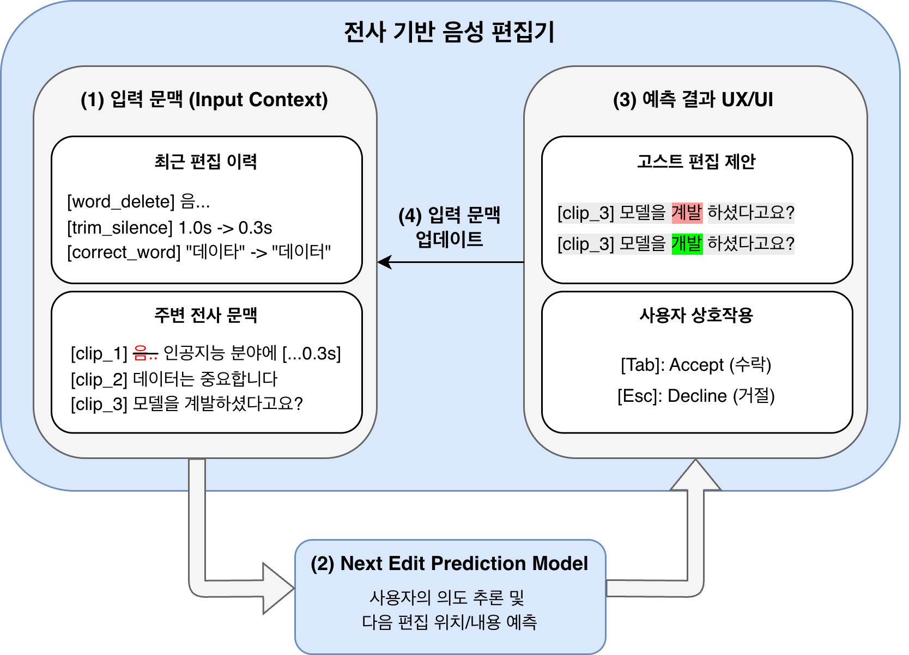
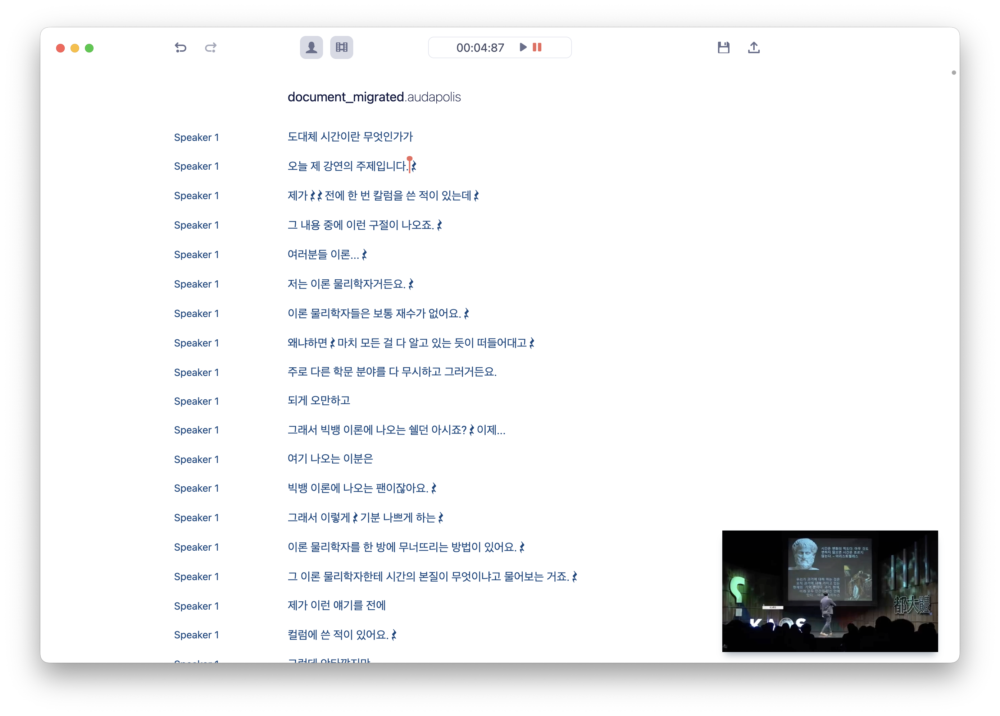

# 전사 기반 음성 편집을 위한 Next Edit Prediction 코파일럿

## 1. 과제의 필요성

### 1.1. Abstract
최근 코드 편집 분야에서는 사용자의 편집 이력과 현재 문맥을 바탕으로 다음 편집을 예측해 제안하는 다음 편집 예측(Next Edit Prediction, 이하 NEP) 기술이 빠르게 발전하고 있다. Cursor, GitHub Copilot, Zed 등은 인라인 제안과 Tab 키 기반 수락 상호작용을 중심으로 예측형 편집 기능을 제공하고 있으며, 관련 연구에서도 다음 편집의 위치와 내용을 함께 예측하는 과제가 본격적으로 다루어지고 있다. 그러나 이러한 연구와 응용은 주로 코드 편집 도메인에 집중되어 있으며, 음성 편집 환경에서의 적용 사례는 아직 제한적이다.

본 과제는 사용자의 최근 편집 이력과 전사문(transcript) 문맥을 바탕으로 다음 편집 행동을 예측하는 전사 기반 음성 편집 코파일럿을 구현하는 것을 목표로 한다. 적용 대상은 강의, 인터뷰, 팟캐스트와 같이 발화 비중이 높은 음성 콘텐츠이다. 전사 기반 편집은 음성 인식(Speech-to-Text)을 통해 음성을 텍스트로 전사한 뒤, 사용자가 전사문을 수정하거나 삭제하면 대응하는 오디오 구간이 함께 편집되는 방식이다. 이 환경에서는 입력이 이미 자연어 형태로 주어지고, 주요 편집 행동이 간투사(예: 어, 음) 제거, 침묵 구간 정리, 자막 분할, 음성 인식 오류 수정 등으로 비교적 한정되어 있어 예측형 편집 보조를 적용하기에 유리하다.

이를 위해 첫째, 오픈소스 전사 편집기 Audapolis를 기반으로 편집 로깅 인프라를 구축하여 전사 편집 NEP 데이터셋을 구성한다. 둘째, 소형 언어 모델에 LoRA(Low-Rank Adaptation) 기반 SFT(Supervised Fine-Tuning)와 DPO(Direct Preference Optimization)를 적용하여 다음 편집 행동을 예측하도록 학습한다. 셋째, 예측 결과를 고스트 텍스트(ghost text) 형태의 인라인 제안으로 제시하고, Tab 키 수락과 Esc 키 거절을 중심으로 한 상호작용 프로토타입을 구현한다. 최종적으로 예측 정확도, 추론 지연 시간을 평가하여 전사 기반 편집 환경에서 NEP 기반 보조 도구의 실현 가능성을 검증하고자 한다.

### 1.2. 서론
음성 및 영상 편집에서 가장 많은 시간이 소모되는 작업은 항상 창의적 판단만은 아니다. 강의, 인터뷰, 회의, 팟캐스트, 유튜브 설명형 영상과 같은 발화 중심 콘텐츠에서는 대개 복잡한 시각 효과보다 간투사 제거, 긴 침묵 구간 정리, 반복 표현 삭제, 자막 분할, 음성 인식 오류 수정과 같이 반복적이지만 집중력을 요구하는 미세 편집이 대량으로 발생한다. Adobe Premiere Pro, Vrew와 같은 상용 영상 편집기 역시 간투사 제거, 침묵 정리, 텍스트 기반 컷 편집 기능을 제공하며, 이러한 반복 작업의 자동화 수요가 충분히 존재함을 보여준다.

그러나 현재의 보조 편집 도구는 명령 기반 또는 일괄 처리 기반에 머무른다. 즉, 사용자가 먼저 기능을 호출해야 하거나, 결과를 한 번에 생성한 뒤 사람이 다시 세밀하게 검토해야 한다. 반면 코드 편집 분야에서는 사용자의 직전 편집 흐름을 읽어 다음 편집을 예측하고, 고스트 텍스트로 제안을 보여준 뒤 Tab 키 한 번으로 수락하게 만드는 상호작용이 빠르게 정착하고 있다. Cursor IDE의 Tab 모델은 매일 4억 건이 넘는 요청을 처리하며, 수락 및 거절 신호를 바탕으로 온라인 강화 학습을 수행한다[1]. GitHub Copilot의 Next Edit Suggestions 또한 최근 편집을 바탕으로 다음 편집의 위치와 내용을 예측하는 공식 기능으로 제공된다.

이러한 변화는 사용자의 다음 행동을 먼저 제안하는 인터페이스가 이미 산업적으로 검증되고 있음을 시사한다. 본 과제는 이 패러다임을 전사 기반 편집으로 옮겨온다. 전사 기반 편집은 다음 세 가지 구조적 이점에서 NEP 적용에 특히 유리하다. 첫째, 입력이 이미 자연어 형태이므로 별도의 시각 인코딩 없이 언어 모델이 직접 처리할 수 있다. 둘째, 편집 행동의 유형이 삭제, 수정, 분할, 축소와 같이 제한적이어서 일반적인 GUI 조작보다 행동 공간이 작다. 셋째, 사용자의 편집에는 순차적 반복성이 나타난다. 예를 들어 사용자가 간투사를 연속으로 삭제하면 다음 간투사도 삭제할 가능성이 높고, 침묵 구간을 특정 길이로 축소하면 이후 침묵에도 같은 기준을 적용할 가능성이 높다. 또한 NEP는 사용자의 과거 편집 이력을 바탕으로 개인의 스타일과 선호를 반영한 추천이 가능하다는 점에서, 모든 사용자에게 동일한 결과를 제공하는 일괄 처리 방식과 근본적으로 구별된다.

따라서 본 과제는 범용 음성 편집 자동화가 아니라, 전사 기반 편집에서 반복적으로 발생하는 저엔트로피 편집을 낮은 지연으로 예측하고 제안하는 코파일럿을 구현하는 데 초점을 둔다. 그림 1은 입력 문맥, 예측 결과, 사용자 수락 및 거절, 그리고 피드백 로그가 다시 다음 예측으로 연결되는 전체 흐름을 보여준다.

## 2. 선행 연구 및 기술 현황

### 2.1. Next Edit Prediction
최근 연구는 현재 커서 주변만 완성하는 인라인 자동 완성과 자연어 지시를 받아 크게 수정하는 채팅형 편집 사이의 간극을 메우기 위해 NEP를 독립적인 과제로 다루기 시작했다. Lu 등은 인라인 자동 완성은 커서 위치에 묶여 있고 채팅형 편집은 사용자의 흐름을 끊는다고 지적하며, 최근 상호작용 이력을 바탕으로 다음 편집의 위치와 내용을 함께 예측하는 NEP 과제를 제안하였다[2]. 3,211개의 SFT 데이터를 구축하여 Qwen2.5-Coder 시리즈에 LoRA SFT를 적용하였고, Exact Match, Partial Match, Position Match, LLM-as-Judge 등의 평가 지표를 함께 제안하였다. Chen 등이 제안한 NES Framework는 위치 모델(location model)과 편집 모델(edit model)을 분리하는 이중 모델 아키텍처를 제안하고, SFT 후 DAPO(Dynamic sAmpling Policy Optimization)를 통한 강화 학습을 적용하였다[3]. 위치 정확도 75.6-81.6%, 편집 유사도 91.36%를 달성하였으며, 2만 명 이상의 개발자에게 배포되어 운영 중이다.

산업 시스템에서도 동일한 흐름이 확인된다. Cursor IDE는 모델이 제안을 "언제 보여줄지" 자체를 학습해야 함을 강조하며, 수락률과 방해 최소화를 동시에 고려하는 온라인 강화 학습 구조로 지속적으로 최적화되고 있다[1]. Zed의 Zeta 모델은 최근 편집과 커서 주변 텍스트를 기반으로 코드를 재작성하는 방식(Edit by Rewrite)을 선택했고, Qwen2.5-Coder-7B에 583개의 소량 데이터로 SFT와 DPO를 적용하여 배포하였다[4].

한편, 보다 넓은 차원의 사용자 행동 예측 연구도 발전하고 있다. LongNAP은 사용자의 멀티모달 상호작용 이력(스크린샷, 클릭, 키보드 입력 등)로부터 다음 행동을 예측하는 과제로, 장기 상호작용 이력과 검색 가능한 메모리를 함께 활용하는 구조를 제안했다[5]. 20명의 사용자로부터 360K 이상의 행동 데이터(1,800시간)를 수집하여 학습한 결과, SFT 대비 79%, 프롬프팅 대비 39%의 성능 향상을 보고하였다.

### 2.2. 전사 기반 편집
전사 기반 편집은 음성 인식을 통해 음성을 텍스트로 전사한 뒤, 사용자가 전사문을 편집하면 대응하는 오디오 구간이 함께 편집되는 방식이다. 이 접근은 미디어 편집 문제를 텍스트 편집 문제로 전환한다는 점에서 의미가 크다. 텍스트와 타임스탬프(timestamp)의 대응 관계가 이미 정립되어 있으므로, 사용자는 파형이나 타임라인을 직접 조작하지 않고도 음성을 편집할 수 있다.

전사 기반 인터페이스의 효용성은 HCI 연구에서도 확인된다. B-Script는 전사 기반 인터페이스가 타임라인 기반 인터페이스보다 작업 속도가 빠르고 인지 부하가 낮으며, 추천 기능을 결합할 경우 결과물의 몰입감도 개선됨을 사용자 연구를 통해 보고하였다[6].

Audapolis는 발화 중심 오디오를 자동 전사하고, 텍스트를 수정하면 연결된 오디오가 함께 편집되는 오픈소스 음성 편집기이다. 음성 인식 오류 수정, 단어 삭제, 자막 분할 기능을 지원하며, 편집 행동이 Redux 액션(action)으로 구조화되어 있어 NEP 문제를 구체적인 행동 공간으로 연결하기에 적합하다. Electron, React, Redux 기반 프론트엔드와 Python 기반 백엔드로 구성된다. 그림 2는 Audapolis의 전사 기반 편집 화면 예시를 보여준다.

### 2.3. 과제 제안 목표와 기술 방향
본 과제의 목표는 전사 기반 음성 편집 환경에서 사용자의 다음 편집 행동을 예측하고 제안하는 코파일럿을 구현하는 것이다. 이를 위해 핵심 편집 행동은 전사 단어 삭제, 긴 침묵 구간의 삭제 또는 축소, 음성 인식 오류 수정, 자막 분할 및 병합, 편집 없음(no action)으로 정의한다.

NEP 모델은 사용자의 최근 편집 이력, 커서 주변 전사문 문맥을 입력으로 사용한다. 최근 편집 이력은 사용자의 직전 의도와 편집 습관을 반영하고, 현재 전사문 문맥은 다음 편집이 일어날 가능성이 높은 부분과 그 내용을 판단하는 데 도움을 준다. 예측 결과는 인라인 고스트 제안으로 제시하며, 사용자는 Tab 키로 제안을 수락하고 Esc 키로 거절할 수 있도록 한다. 이를 통해 모델 성능만 평가하는 데 그치지 않고, 실제 편집 흐름 속에서 자연스럽게 활용할 수 있는 상호작용 방식까지 함께 구현하고 평가하고자 한다.

## 3. 작품/논문 전체 진행 계획 및 구성

### 3.1. Audapolis 편집기 인프라 구축
핵심 편집 행동 공간에 필요한 기능을 Audapolis에 추가한다. 기존 Vosk 기반 음성 인식은 성능이 낮고 간투사(어, 음 등)를 별도로 인식하지 못하므로, Whisper 또는 ElevenLabs 음성 인식으로 교체하여 간투사를 포함한 전사 결과를 얻도록 한다. 현재 Audapolis에 없는 침묵 길이 조절과 같은 핵심 동작을 지원하도록 Redux 액션을 새로 정의해 추가한다.

이와 함께 Redux 상태 변경 지점에 편집 액션과 상태를 기록하는 로깅 미들웨어를 삽입하여, 이후 학습 데이터의 원본이 되는 편집 이력 데이터를 축적한다. 또한 예측 결과를 사용자에게 보여주기 위한 고스트 텍스트 제안 영역과 Tab 키 수락, Esc 키 거절 상호작용을 구현하여 모델 학습과 사용자 평가를 모두 지원하는 실험 환경을 마련한다.

### 3.2. 데이터셋 구축
데이터셋은 세 가지 방식으로 구축한다. 첫째, 로깅 미들웨어가 적용된 편집기에서 직접 전사 편집을 수행하여 실제 편집 이력을 수집한다. 둘째, 공개 발화 음성 자료를 전사한 뒤 간투사, 침묵 구간, 반복 오류를 기준으로 합성 편집 데이터를 생성한다. 셋째, 필요할 경우 소수의 고품질 예시는 대형 언어 모델을 이용한 증류 방식으로 보강한다.

하나의 학습 샘플은 시스템 프롬프트, 최근 편집 이력, 현재 전사문 문맥으로 구성한다. 이때 모델의 출력 형식은 고정하지 않고, 실험 단계에서 두 가지 후보 형식을 비교한다. 첫 번째는 Edit by Rewrite 방식으로, 모델이 편집이 필요한 구간을 포함한 텍스트를 다시 작성하는 형태이다. 두 번째는 Structured JSON 방식으로, 모델이 편집 행동의 유형과 대상 위치, 수정 내용을 명시적으로 구조화된 JSON 형태로 출력하는 방식이다. Edit by Rewrite 방식은 주변 전사문을 다시 생성한다는 점에서 자연스럽고 다중 수정에 유리할 수 있으나, 불필요한 변경이 함께 발생할 가능성이 있다. 반면 Structured JSON 방식은 편집 액션을 명시적으로 표현할 수 있어 해석과 실행이 용이하지만, 형식 오류가 발생하면 바로 적용하기 어렵다. 표 1은 모델 입력과 두 가지 출력 형식의 예시를 보여준다.

### 3.3. LoRA 기반 SFT 학습
소형 언어 모델을 대상으로 LoRA 기반 SFT를 수행한다. 이 단계의 목적은 전사 기반 편집에 적합한 출력 형식과 모델 구성을 실증적으로 비교하는 것이다. 이를 위해 3.2에서 구축한 동일한 원시 데이터를 두 가지 후보 출력 형식으로 각각 변환하여 학습하고, 예측 정확도, 형식 유효성, 추론 지연 시간을 비교한다. 또한 과잉 삭제, 잘못된 위치 예측, 환각 등 주요 실패 양상을 유형별로 정리하여 다음 DPO 단계에서의 데이터 구성의 기준을 세운다.

표 1. 데이터 샘플 예시

<table>
  <thead>
    <tr>
      <th></th>
      <th>데이터 샘플 예시</th>
    </tr>
  </thead>
  <tbody>
    <tr>
      <td>모델 입력</td>
      <td><code>&lt;|system|&gt;</code> <code>You are a transcript editing assistant. (...)</code> <code>&lt;|history|&gt;</code> <code>[correct_word] “데이타” → “데이터”</code> <code>[trim_silence] Trimmed silence 1.0s -&gt; 0.3s</code> <code>&lt;|transcript|&gt;</code> <code>[clip_5] (text “인공지능”) (text “데이터는”) (text “중요합니다”)</code> <code>[clip_6] (silence [0.3s])</code> <code>[clip_7] (text “모델을”) &lt;|cursor|&gt; (text “계발하셨다고요?”)</code> <code>&lt;|prediction|&gt;</code></td>
    </tr>
    <tr>
      <td>모델 출력 A Edit by Rewrite</td>
      <td><code>[clip_5] (text “인공지능”) (text “데이터는”) (text “중요합니다”)</code> <code>[clip_6] (silence [0.3s])</code> <code>[clip_7] (text “모델을”) (text “개발하셨다고요?”)</code></td>
    </tr>
    <tr>
      <td>모델 출력 B Structured JSON</td>
      <td><code>{</code> <code>  “action”: “correct_word”,</code> <code>  “target_uuid”: “b2c4”,</code> <code>  “params”: {“text”: “개발하셨다고요?”}</code> <code>}</code></td>
    </tr>
  </tbody>
</table>

### 3.4. 편집기 통합 및 DPO 기반 정교화
3.3에서 선정된 모델과 출력 형식을 바탕으로 로컬 추론 서버를 구성하고, 이를 편집기의 고스트 텍스트 제안 인터페이스와 연동한다. 사용자의 편집 직후 예측을 요청하고, 생성된 결과를 인라인 제안으로 표시함으로써 실제 편집 흐름 속에서 전 과정 상호작용이 가능하도록 한다.

이후 프로토타입 사용 과정에서 발생하는 Tab 키 수락과 Esc 키 거절 신호를 다시 로깅하여 선호 학습용 데이터로 변환한다. 수락된 제안은 긍정 예시, 거절된 제안은 부정 예시로 활용하여 DPO를 적용하고, SFT만으로는 남기 쉬운 과잉 편집과 부정확한 수정 문제를 완화한다.

### 3.5. 평가
테스트 데이터셋에 대해 행동 유형 정확도, 위치 정확도, 형식 유효성, 추론 지연 시간을 측정한다. 베이스라인은 In-context learning, SFT-only, SFT+DPO로 구성하여 각 단계의 기여를 분리한다.

## 4. 기대효과 및 개선방향
본 과제의 기대효과는 전사 기반 음성 편집에서 반복적인 미세 편집 부담을 줄이는 것이다. 사용자는 간투사 제거, 음성 인식 오류 수정, 자막 분할과 같은 편집을 매번 수동으로 하지 않고, 예측된 제안을 검토한 뒤 빠르게 수락할 수 있다. 이는 사용자가 일일이 명령을 내리거나 일괄 편집을 실행하는 방식보다 더 자연스럽고, 편집 흐름을 유지하면서 반복 작업을 줄여주는 실용적 보조 도구가 될 수 있다.

향후에는 현재의 음성 편집 중심 범위를 전사 기반 영상 편집으로 확장할 수 있다. 예를 들어 B-roll 추천, 장면 전환 편집, 자막 강조와 같은 인접 기능으로 확장이 가능하다. 또한 개인별 편집 습관을 반영하기 위한 검색 기반 기억 모듈이나 장기 상호작용 이력 활용 구조를 도입하면 개인화된 예측이 가능할 것으로 기대한다.

## 5. 기타

### 5.1. 비용 분석
| 세부 항목 | 소요 경비 (원) |
| --- | --- |
| Google Colab Pro (모델 학습) | 월 60,000 |
| LLM API 비용 (합성 데이터 생성) | 월 30,000 |
| ElevenLabs STT (전사 데이터 생성) | 월 30,000 |

## 6. 참고문헌

[1] J. Jackson, P. Kravtsov, and S. Jain, “Improving Cursor Tab with online RL,” Cursor Research Blog, Sep. 2025. https://cursor.com/blog/tab-rl

[2] R. Lu, Y. Huo, M. Zhang, Y. Li, and M. R. Lyu, “Next Edit Prediction: Learning to Predict Code Edits from Context and Interaction History,” arXiv:2508.10074, 2025.

[3] X. Chen, S. Xiao, X. Zhu, J. Xie, M. Liang, D. Chen, W. Jiang, Y. Li, and P. Di, “An Efficient and Adaptive Next Edit Suggestion Framework with Zero Human Instructions in IDEs,” arXiv:2508.02473, 2025.

[4] A. Scandurra and N. Sobo, “Zed now predicts your next edit with Zeta, our new open model,” Zed Blog, Feb. 2025. https://zed.dev/blog/edit-prediction

[5] O. Shaikh, V. Teutschbein, K. Gandhi, Y. Chi, N. Haber, T. Robinson, N. Ram, B. Reeves, S. Yang, M. S. Bernstein, and D. Yang, “Learning Next Action Predictors from Human-Computer Interaction,” arXiv:2603.05923, 2026.

[6] B. Huber, H. V. Shin, B. Russell, O. Wang, and G. J. Mysore, “B-Script: Transcript-based B-roll Video Editing with Recommendations,” in Proceedings of the CHI Conference on Human Factors in Computing Systems, 2019.
